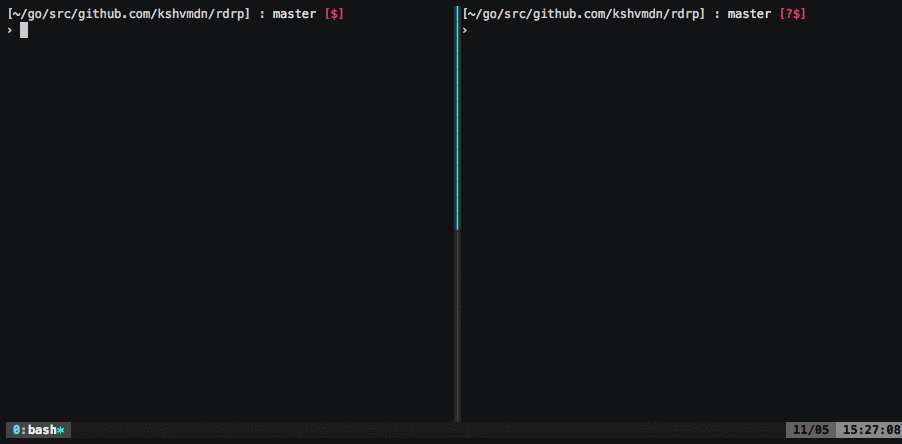

## rdrp

> A cross-platform command line tool for sending and receiving files over your local network, inspired by [AirDrop](https://support.apple.com/en-ca/HT204144).

- [Demo](#demo)
- [Design](#design)
- [Installation](#installation-setup)
- [Usage](#usage)
- [Contribute](#contribute)

### Demo

<a href="https://asciinema.org/a/120148"></a>

### Design

rdrp uses [Multicast DNS](https://en.wikipedia.org/wiki/Multicast_DNS) to enable peer-to-peer discovery between clients. This means that rdrp will likely **not** work in most cloud/virtual environments.

When a client first connects, they're registered as a new instance on the `_rdrp._tcp` service. Each sender continuously browses this service for newly connected broadcasters with whom they'll establish a connection and attempt to send their respective file.

This program implements mDNS with [grandcat/zeroconf](https://github.com/grandcat/zeroconf).

Read more about mDNS: [RFC 6762](https://tools.ietf.org/html/rfc6762) and DNS-SD: [RFC 6763](https://tools.ietf.org/html/rfc6763).

### Installation / setup

  - Go should be [installed](https://golang.org/doc/install) and [configured](https://golang.org/doc/install#testing).

  - Install with Go:

    ```sh
    $ go get -v github.com/kshvmdn/rdrp/...
    $ which rdrp
    $GOPATH/bin/rdrp
    ```

  - Or, install directly via source:

    ```sh
    $ git clone https://github.com/kshvmdn/rdrp.git $GOPATH/src/github.com/kshvmdn/rdrp
    $ cd $_ # $GOPATH/src/github.com/kshvmdn/rdrp
    $ make install && make
    $ ./rdrp
    ```

### Usage

  - There's two parties involved in a single transaction: the sender and the receiver.

  - To broadcast yourself as a receiver (i.e. someone receiving a file), use the `broadcast` command. You'll be listening for incoming `send` requests. Upon a new connection, you'll be prompted on whether you'd like to accept the file or not, just like AirDrop. The incoming file is copied to stdout.

    ```sh
    $ rdrp broadcast -help
    Usage of broadcast:
      -name string
          Display name
    $ # EXAMPLE:
    $ rdrp broadcast -name broadcaster > ~/Desktop/file.md
    ```

  - To send a file over your local network, use the `send` command. To specify the file, use the `-file` flag. Every broadcaster will receive a request to transfer the file. This process continues until aborted (Ctrl+C).

    ```sh
    $ rdrp send -help
    Usage of send:
      -file string
          File to transfer
      -name string
          Display name
    $ # EXAMPLE:
    $ rdrp send -name sender -file README.md
    ```

  - Note that the name flag is optional for both, if not provided, a name is chosen randomly (which is what happened in the demos above).

### Contribute

This project is completely open source, feel free to [open an issue](https://github.com/kshvmdn/rdrp/issues) for questions/features/bugs or [submit a pull request](https://github.com/kshvmdn/rdrp/pulls).

#### TODO

- [ ] Add an option for senders to provide a list of names to send the file to (right now, when a file is sent, all connected clients get the prompt).
- [ ] Add a `-list` flag to list all currently connected peers (this'll help with the previous TODO I think).
- [ ] Check that the registration name is not already being used.
- [ ] Add an option to send files via stdin. That way it'll be possible to do something like `gzip` a folder and directly pipe that into `rdrp` (instead of doing the two separately).
- [ ] Test. This is only tested on macOS right now, would be great if there was some confirmation that it works on Linux as well (and I guess Windows too).
